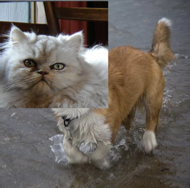

# 🎃 CutMix

[\[How to Use\]](#how-to-use) - [\[Suggested Hyperparameters\]](#suggested-hyperparameters) - [\[Technical Details\]](#technical-details) - [\[Attribution\]](#attribution)

`Computer Vision`

CutMix is a data augmentation technique that modifies images by cutting out a small patch and replacing it with a different image.
It is a regularization technique that improves the generalization accuracy of models for computer vision.

|  |
|:--:
|*An image with CutMix applied. A picture of a cat has been placed over the top left corner of a picture of a dog. This is an image of [Figure 1 from Yun et al. (2019)](https://arxiv.org/abs/1905.04899).*|

## How to Use

### Functional Interface

```python
import torch

from composer.algorithms.cutmix import cutmix_batch

def training_loop(model, train_loader):
  opt = torch.optim.Adam(model.parameters())
  loss_fn = F.cross_entropy
  model.train()

  for epoch in range(num_epochs):
      for X, y in train_loader:
          X, y = cutmix_batch(X=X, y=y, n_classes=1000, alpha=1.0)
          y_hat = model(X)
          loss = loss_fn(y_hat, y)
          loss.backward()
          opt.step()
          opt.zero_grad()
```

### Composer Trainer

```python
from composer.algorithms import CutMix
from composer.trainer import Trainer

cutmix_algorithm = CutMix(num_classes=1000, alpha=1.0)
trainer = Trainer(model=model,
                  train_dataloader=train_dataloader,
                  max_duration='1ep',
                  algorithms=[cutmix_algorithm])

trainer.fit()
```

### Implementation Details

CutMix is implemented following the [original paper](1905.04899). This means CutMix runs immediately before the training example is provided to the model, and on the GPU if one is being used.

The construction of the bounding box for the mixed region follows the [paper's implementation](https://github.com/clovaai/CutMix-PyTorch) which selects the top left pixel of the bounding box uniformly at random from all locations in the image, and clips the bounding box to fit. This implies that the size of the region mixed by CutMix is not always square, and the area is not directly drawn from a beta distribution. It also implies that regions in the bottom right of the image are more likely to be selected than those in the top left.

## Suggested Hyperparameters

Setting `alpha=1` is a standard choice. This produces a uniform distribution, meaning `lambda` (the interpolation between the labels of the two sets of examples) is selected uniformly between 0 and 1.

## Technical Details

CutMix works by creating a new mini-batch of inputs to the network by operating on a batch `(X1, y1)` of (inputs, targets) together with version `(X2, y2)` with the same examples but where the ordering of examples has been shuffled.
The final set of inputs `X` is created by choosing a rectangular box within each example `x1` in `X1` and filling it with the data from the same region from the corresponding example `x2` in `X2`.
The final set of targets `y` is created by sampling a value `lambda` (between 0.0 and 1.0) from the Beta distribution parameterized by `alpha` and interpolating between the targets `y1` and `y2`.


> ❗ CutMix Produces a Full Distribution, Not a Target Index
>
> Many classification tasks represent the target value using the index of the target value rather than the full one-hot encoding of the label value.
> Since CutMix interpolates between two target values for each example, it must represent the final targets as a dense distribution.
> Our implementation of CutMix turns each label into a dense distribution (if it has not already been converted into a distribution).
> The loss function used for the model must be able to accept this dense distribution as the target.

CutMix is intended to improve generalization performance, and we empirically found this to be the case in our image classification settings. The original paper also reports improvements in object localization and robustness.

Similar to MixUp, using the shuffled version of a batch to generate mixed samples (rather than sampling an entirely new batch) allows CutMix to be used without loading additional data. This choice avoids putting additional strain on the dataloader.


> 🚧 Composing Regularization Methods
>
> As general rule, composing regularization methods may lead to diminishing returns in quality improvements. CutMix is one such regularization method.

Data augmentation techniques can sometimes put additional load on the CPU, potentially reaching the point where the CPU becomes a bottleneck for training.
To prevent this from happening for CutMix, our implementation of CutMix (1) occurs on the GPU and (2) uses the same patch and value of `lambda` for all examples in the minibatch.
Doing so avoids putting additional work on the CPU (since augmentation occurs on the GPU) and avoids putting additional work on the GPU (since all images are handled uniformly within a batch).

## Attribution

[*CutMix: Regularization Strategy to Train Strong Classifiers with Localizable Features*](1905.04899) by Sangdoo Yun, Dongyoon Han, Seong Joon Oh, Sanghyuk Chun, Junsuk Choe, and Youngjoon Yoo. Published in ICCV 2019.

*This Composer implementation of this method and the accompanying documentation were produced by Cory Stephenson at MosaicML.*
